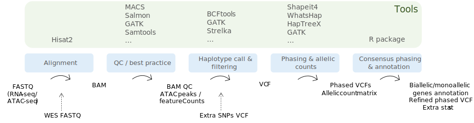

# ASTRA bulk pipeline

Snakemake workflow for the analysis of allele specific expression and/or chromatin accessibility from sequencing data.



## Input files needed

As input are needed the gzipped fastq file of *one* sample.
It is possible to use either RNA-seq and/or ATAC-seq and eventual WES fastq files.

## Reference files preparation

### Genome gtf and fasta files
Files available on [Ensembl web site](https://www.ensembl.org/Homo_sapiens/Info/Index).

GRCh38 download:

```bash 
wget http://ftp.ensembl.org/pub/release-107/gtf/homo_sapiens/Homo_sapiens.GRCh38.107.chr.gtf.gz
gzip -d Homo_sapiens.GRCh38.107.chr.gtf.gz
wget http://ftp.ensembl.org/pub/release-107/fasta/homo_sapiens/dna/Homo_sapiens.GRCh38.dna.primary_assembly.fa.gz
gzip -d Homo_sapiens.GRCh38.dna.primary_assembly.fa.gz
```
Add file paths to [config file](config/config.yaml) in `genome_gtf` and `genome_fa`

### Hisat2
Prepare [hisat2](https://www.nature.com/articles/s41587-019-0201-4) index files available [here](http://daehwankimlab.github.io/hisat2/download/) for download or preparation instructions with custom reference available [here](http://daehwankimlab.github.io/hisat2/howto/#build-hgfm-index-with-snps-and-transcripts). 

For an example look at this [file](hisat_indexes.sh).

### Haptree-X
The Haptree-X excecutable file can be downloaded from [here](https://github.com/0xTCG/haptreex/releases).

### Other reference files 

dbSNPs for variant calling with Shapeit4 available [here]()


<details><summary>GRCh38 download example </summary>
<p> 

```bash 
for i in {1..22} X;do wget http://ftp.1000genomes.ebi.ac.uk/vol1/ftp/data_collections/1000G_2504_high_coverage/working/20220422_3202_phased_SNV_INDEL_SV/1kGP_high_coverage_Illumina.chr$i.filtered.SNV_INDEL_SV_phased_panel.vcf.gz; done

for i in {1..22} X; do wget http://ftp.1000genomes.ebi.ac.uk/vol1/ftp/data_collections/1000G_2504_high_coverage/working/20220422_3202_phased_SNV_INDEL_SV/1kGP_high_coverage_Illumina.chr$i.filtered.SNV_INDEL_SV_phased_panel.vcf.gz.tbi; done
```

</p>
</details>

## How to run

```bash
snakemake --cores [cores_number] --use-conda --use-singularity
```

## Results architecture
